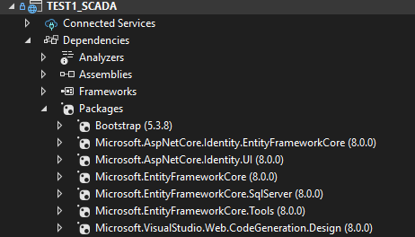

# Hướng dẫn sử dụng code MVC cho hệ SCADA Hải Dương
- Đôi khi t cũng không biết t đang code cái gì cả nên tự học đi... GPT hỗ trợ cho
-  Đéo có gì trong này để đọc đâu nên ấn vào là vô nghĩa
# Tự học MVC
- Xem MVC là gì?
- Cấu trúc MVC?
- Cách nó hoạt động đi đã rồi quay lại đây đọc code
# Source để học
- Link xem MVC của nước ngoài
[https://learn.microsoft.com/vi-vn/aspnet/core/tutorials/first-mvc-app/start-mvc?view=aspnetcore-9.0&tabs=visual-studio](https://learn.microsoft.com/vi-vn/aspnet/core/tutorials/first-mvc-app/start-mvc?view=aspnetcore-9.0&tabs=visual-studio)
- Link Youtube tiếng việt để học: [https://www.youtube.com/watch?v=Y_gJyI_3cZ4&list=PLf5IPckgFwFUdtFXnvNjwgFdflTjKk0gF](https://www.youtube.com/watch?v=Y_gJyI_3cZ4&list=PLf5IPckgFwFUdtFXnvNjwgFdflTjKk0gF)
- Đọc về nhà máy MASAN Hải Dương trước trong Driver này nhé: [https://drive.google.com/drive/u/2/folders/1MjhY4KvMj9uCmHyBwZ06CCv82eM8IGPM]
- Đọc thêm về cách học MVC ở đây nữa nhé (Nên đọc đầu tiên và tự làm đầu tiên): [https://docs.google.com/document/d/1T_RjjgXzTjDXqyR2Z62gHd7a4fahCco-/edit?usp=sharing&ouid=116602784551489566292&rtpof=true&sd=true]
- Nên đọc trước cái file docs có tên "Cài Đặt + Setup + Các kiểu hay dùng trong MVC ( nên đọc trước)" nhé
- File docs báo cáo:
- File PPT báo cáo:
- Chúc các con vợ đọc code đéo hiểu mẹ gì!!!
# LƯU Ý CỰC KỲ KINH KHỦNG:
- Khi đọc code, để dễ hiểu, khuyến cáo chúng mày dow cái file zip của git này về rồi giải nén ra, mở bằng VS tím, mỗi đoạn code chỉ cần thêm comment đằng sau cho nó theo kiểu "\\\ " thì nó sẽ tự comment cho đoạn code đó viết cái gì, nội dung ra sao
- Để chạy được code này thì các con vợ phải cài thêm package của code, khá nhiều, cài ẻ vcl luôn
- Cài các thư viện như trong ảnh nhé:

  

- Mà muốn chạy thì phải đổi tên cơ sở dữ liệu theo máy của cmay ở phần "appsettings.json" chỗ đoạn có link cơ sở dữ liệu đấy, ko đổi thì bố nào chạy được
- Nói chung là để chạy đc code này của t trên máy chúng mày thì cũng cần phải tìm cách add các bảng cơ sở dữ liệu lên máy
- Code này sử dụng thư viện "Bootstrap" để tạo phần view, nôm na là nó sẽ giống như css cho html, kiểu vậy
- Cài Bootstrap bằng lệnh: Install-Package Bootstrap
- Cài NuGet để xuất Excel + Word:
1. dotnet add package ClosedXML			=> dùng để tạo excel
2. dotnet add package Xceed.Words.NET		=> dùng để tạo word, nhưng phải có license => ko dùng
3. dotnet add package DocumentFormat.OpenXml	=> dùng thay thế bằng cái này để tạo word
# Khi mở code này, nếu đéo biết chạy kiểu gì thì cứ liên hệ tao qua 2 phương thức:
- Facebook: [https://www.facebook.com/nguyenngocquy040903]
- Zalo: 0385263527
